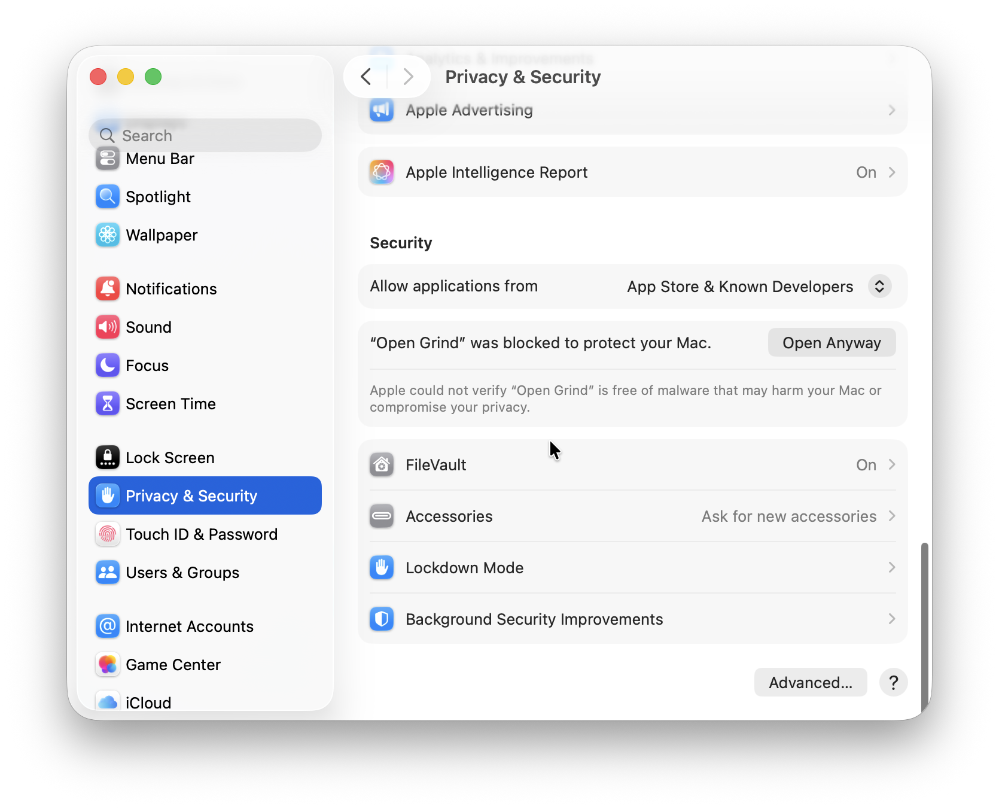

<script setup>
    import { VPButton } from 'vitepress/theme';
</script>

# Download Open Grind

Never download Open Grind from unofficial sources. The only official sources of Open Grind are https://git.opengrind.org/open-grind/open-grind/releases and [Google Play](https://play.google.com/store/apps/details?id=org.opengrind). All releases are signed and reproducible.

> [!Warning] 🚧&nbsp;&nbsp;Open Grind is in active development.&nbsp;&nbsp;🚧
> [Contribute to the project](https://git.opengrind.org/open-grind/open-grind/) or [join the discussion](https://matrix.to/#/#opengrind:opengrind.org) to help us prioritize features and improvements.

## Android

<div class="vpbuttons-row">
    <VPButton href="https://git.opengrind.org/open-grind/open-grind/releases/download/v0.1.0-beta.5/open-grind-v0.1.0-beta.5-android.apk" size="medium">Download for Android (apk)</VPButton>
    <VPButton href="https://play.google.com/store/apps/details?id=org.opengrind" size="medium" theme="alt">Install from Google Play</VPButton>
</div>

To install the APK, use your system's APK installer and optionally enable auto updates.

- **Switching between Google Play and the APK** (or F-Droid) requires uninstalling first, because Google signs its version with its own key. Uninstalling signs you out and resets app settings.
- **Add-ons** (Google sign-in, fast notifications, reCAPTCHA helper) can't be installed by the Google Play version. Install them from their pages: [Sign in with Google](/guides/sign-in-with-google#installed-from-google-play), [Notifications](/guides/notifications).
- **To verify the Google Play version**, follow [Verify Google Play install](https://git.opengrind.org/open-grind/open-grind/src/branch/main/BUILDING.md#verify-google-play-install).

## Windows

<div class="vpbuttons-row">
    <VPButton href="https://git.opengrind.org/open-grind/open-grind/releases/download/v0.1.0-beta.5/open-grind-v0.1.0-beta.5-windows-x86_64.exe" size="medium">Download for Windows x86_64</VPButton>
    <VPButton href="https://git.opengrind.org/open-grind/open-grind/releases/download/v0.1.0-beta.5/open-grind-v0.1.0-beta.5-windows-arm64.exe" size="medium">Download for Windows arm64</VPButton>
</div>

Launch the installer and follow the steps.

- **To install updates**, enable the auto-updater.
- **To uninstall**, use the bundled uninstall.exe. Check "delete app data" to delete the session and preferences.

## Linux

Notes:

- GPS is not available through the geolocation plugin on Linux
- Without a Secret Service your sign-in is kept in a plain file under the app data directory
- If the window stays blank, flickers, closes instantly or draws parts of the app wrong, see [Rendering problems](#rendering-problems)

### AppImage (any distribution)

The AppImage runs on any distribution that has WebKitGTK 4.1.

Install WebKitGTK 4.1:

| Distribution   | Package               |
| -------------- | --------------------- |
| Debian, Ubuntu | `libwebkit2gtk-4.1-0` |
| Arch Linux     | `webkit2gtk-4.1`      |
| Fedora         | `webkit2gtk4.1`       |
| openSUSE       | `libwebkit2gtk-4_1-0` |

<div class="vpbuttons-row">
    <VPButton href="https://git.opengrind.org/open-grind/open-grind/releases/download/v0.1.0-beta.5/open-grind-v0.1.0-beta.5-linux-x86_64.AppImage" size="medium">Download for Linux x86_64 (AppImage)</VPButton>
    <VPButton href="https://git.opengrind.org/open-grind/open-grind/releases/download/v0.1.0-beta.5/open-grind-v0.1.0-beta.5-linux-arm64.AppImage" size="medium">Download for Linux arm64 (AppImage)</VPButton>
</div>

Make the AppImage executable and run it:

```sh
chmod +x open-grind-*.AppImage
./open-grind-*.AppImage
```

In GNOME Files, the same thing is Properties &rarr; Permissions &rarr; "Executable as Program".

- **To play videos**, install a H.264 decoder. See [Install video codecs on Linux](/guides/codecs).
- **To add a desktop entry**, click App Settings &rarr; Display &rarr; "Show in apps menu".
- **To install updates**, enable the auto-updater.
- **To uninstall**, clear Open Grind's secrets from your Secret Service, then delete the AppImage.

### deb (Debian, Ubuntu, Linux Mint, other Debian-based)

<div class="vpbuttons-row">
    <VPButton href="https://git.opengrind.org/open-grind/open-grind/releases/download/v0.1.0-beta.5/open-grind-v0.1.0-beta.5-linux-x86_64.deb" size="medium">Download for Debian/Ubuntu x86_64 (deb)</VPButton>
    <VPButton href="https://git.opengrind.org/open-grind/open-grind/releases/download/v0.1.0-beta.5/open-grind-v0.1.0-beta.5-linux-arm64.deb" size="medium">Download for Debian/Ubuntu arm64 (deb)</VPButton>
</div>

- **To install updates**, set up [apt](#apt-repository). Auto-updater is not available for deb releases.
- **To uninstall**, manually clear all secrets from your Secret Service, then run `apt purge`.

#### apt repository

Debian, Ubuntu and derivatives can install Open Grind from the project's own repository, so `apt` handles updates:

```sh
sudo install -d -m 0755 /etc/apt/keyrings
curl -fsSL https://git.opengrind.org/api/packages/open-grind/debian/repository.key \
	| sudo tee /etc/apt/keyrings/opengrind.asc > /dev/null
sudo tee /etc/apt/sources.list.d/opengrind.sources > /dev/null <<'EOF'
Types: deb
URIs: https://git.opengrind.org/api/packages/open-grind/debian
Suites: beta
Components: main
Signed-By: /etc/apt/keyrings/opengrind.asc
EOF
sudo apt update && sudo apt install open-grind
```

Open Grind is still in beta, so every release so far is published to the `beta` suite. Once stable, use `Suites: stable` to track those instead. To remove the repository, delete both files.

> [!Note] Trust
> The repository index is signed by a key held on the server. The release artifacts and their `.minisig` signatures stay the canonical, reproducible download — the repository only exists so updates arrive through your package manager.

### Arch Linux

As of September 1st, 2026, AUR has disabled account registration and new package publishing, so it's not possible to install Open Grind from AUR right now.

The PKGBUILD for Arch Linux can be found in [ci/aur/PKGBUILD](https://git.opengrind.org/open-grind/open-grind/src/branch/main/ci/aur/PKGBUILD).

### Rendering problems

Window is drawn with WebKitGTK and your graphics driver. With some combinations, parts of the window draw wrong.

1. Update your system. WebKitGTK 2.54 fixed several scrolling glitches.
2. Try closing Open Grind, then launching from a terminal with one of these settings:
   - `WEBKIT_SKIA_ENABLE_CPU_RENDERING=1` if icons, images or text look broken. Blur works.
   - `WEBKIT_DMABUF_RENDERER_FORCE_SHM=1` if the window flickers or turns black. Blur works.
   - `WEBKIT_DISABLE_DMABUF_RENDERER=1` if rows disappear while you scroll, or if nothing else helps. Blur is turned off and scrolling is less smooth.

   ```sh
   WEBKIT_DISABLE_DMABUF_RENDERER=1 ./open-grind-*.AppImage
   ```

For the deb or Arch package, run `WEBKIT_DISABLE_DMABUF_RENDERER=1 open-grind`.

On NVIDIA, the launcher already sets `__NV_DISABLE_EXPLICIT_SYNC=1`, which fixes the "Error 71 (Protocol error)" crash on Wayland. If the window only flickers, try `__NV_DISABLE_EXPLICIT_SYNC=0` before the settings above.

When you [report a rendering problem](https://git.opengrind.org/open-grind/open-grind/issues/new?template=.forgejo%2fissue_template%2fbug.yaml), include your GPU and driver version, your WebKitGTK version, whether you use Wayland or X11, and which settings you tried.

## macOS

<div class="vpbuttons-row">
    <VPButton href="https://git.opengrind.org/open-grind/open-grind/releases/download/v0.1.0-beta.5/open-grind-v0.1.0-beta.5-macos.zip" size="medium">Download for macOS (universal)</VPButton>
</div>

Extract Open&nbsp;Grind.app from zip archive and move to Applications folder.

::: info If you get "Apple could not verify “Open Grind” is free of malware that may harm your Mac or compromise your privacy.",

1. Open System Settings
2. Go to "Privacy & Security"
3. Scroll to "“Open Grind” was blocked to protect your Mac."



4. Click "Open Anyway"
5. In the "Open “Open Grind”?" dialog click "Open Anyway"
6. Enter administrator password or Touch ID
:::

- **To install updates**, enable the auto-updater.
- **To uninstall**, move the app from Applications to Trash.

## iOS

**iOS is currently not supported.** Open Grind iOS builds are likely to be released in Fall 2026 with the upcoming publishing in the third party app stores.

